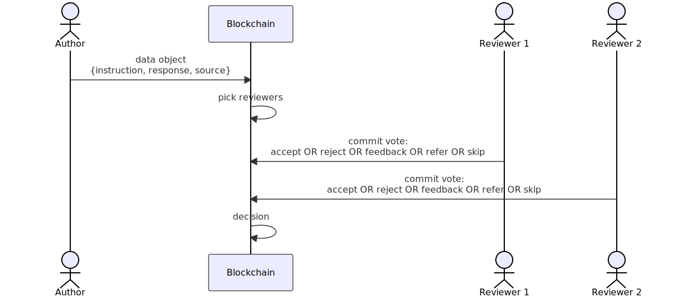

# GoodPrompt: transparent, decentralized, peer-reviewed data submissionA

We introduce an on-chain peer-review process for AI training data. The process enhances AI's transparency, privacy safeguards, accuracy, cost-efficiency, and trustworthiness. The peer-review process is similar to scientific publishing. First, an author submits a data object, which may contain an instructional prompt, context, licenses, and response. Then, reviewers can accept, refer to an expert, ask for improvement, or reject the data object. The final result is a dataset of peer-reviewed data objects transparently stored on a trusted infrastructure such as decentralized ledger. Compensation for authors and reviewers will be governed by a smart-contract based on the authors' and reviewers' reputation and the quality of the submitted objects.

# Flow

